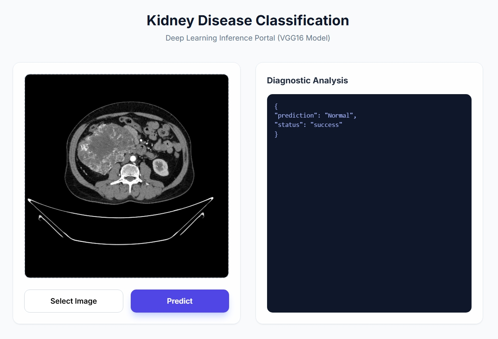
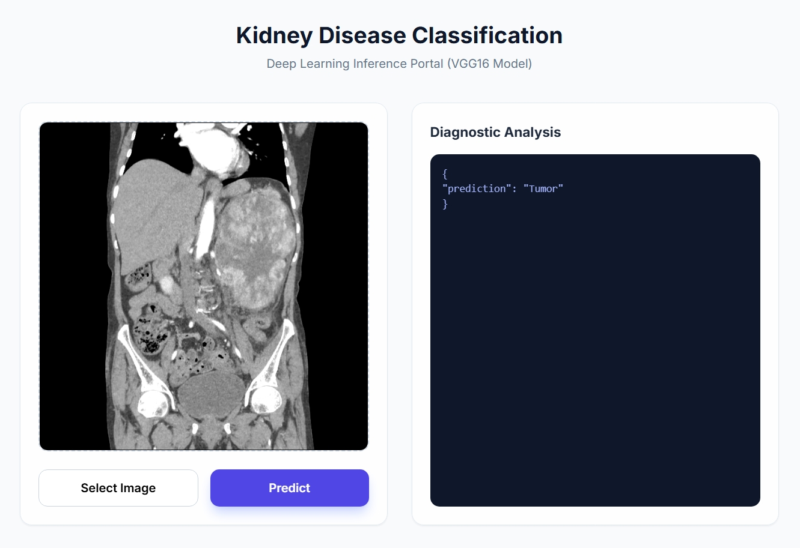

# Kidney-Disease-Classification

This project is a **Deep Learning Inference Portal** designed to classify kidney CT scans. It leverages a fine-tuned **VGG16** convolutional neural network to distinguish between different kidney conditions, such as identifying tumors versus normal tissue.

---

## 🖥️ User Interface

The application features a clean, professional dashboard designed for medical image analysis. It provides immediate feedback through a structured JSON diagnostic panel.

### 1. Normal Scan Detection
When a healthy kidney CT scan is uploaded, the model identifies the features as "Normal."

### 2. Tumor Detection
The interface highlights the detection of abnormalities, providing a "Tumor" prediction for clinical review.

---

## 🚀 Key Features

* **VGG16 Architecture:** Utilizes a robust Transfer Learning approach for high-accuracy medical image classification.
* **Real-time Inference:** Immediate processing and prediction upon clicking the "Predict" button.
* **JSON API Response:** The diagnostic analysis is displayed in a raw JSON format, making it easy to integrate with other hospital management systems.

---

## 🛠️ Tech Stack

* **Frontend:** HTML5, CSS3, JavaScript
* **Backend:** Python (Flask/FastAPI)
* **Deep Learning:** TensorFlow/Keras

